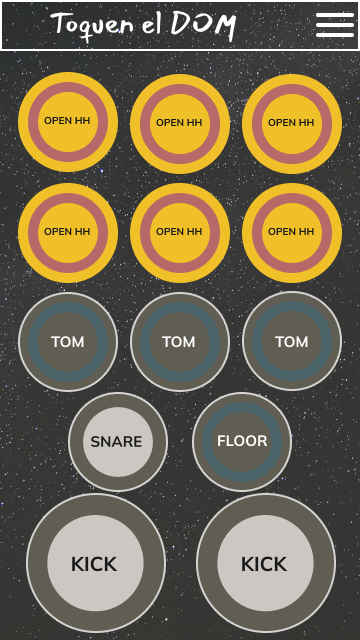
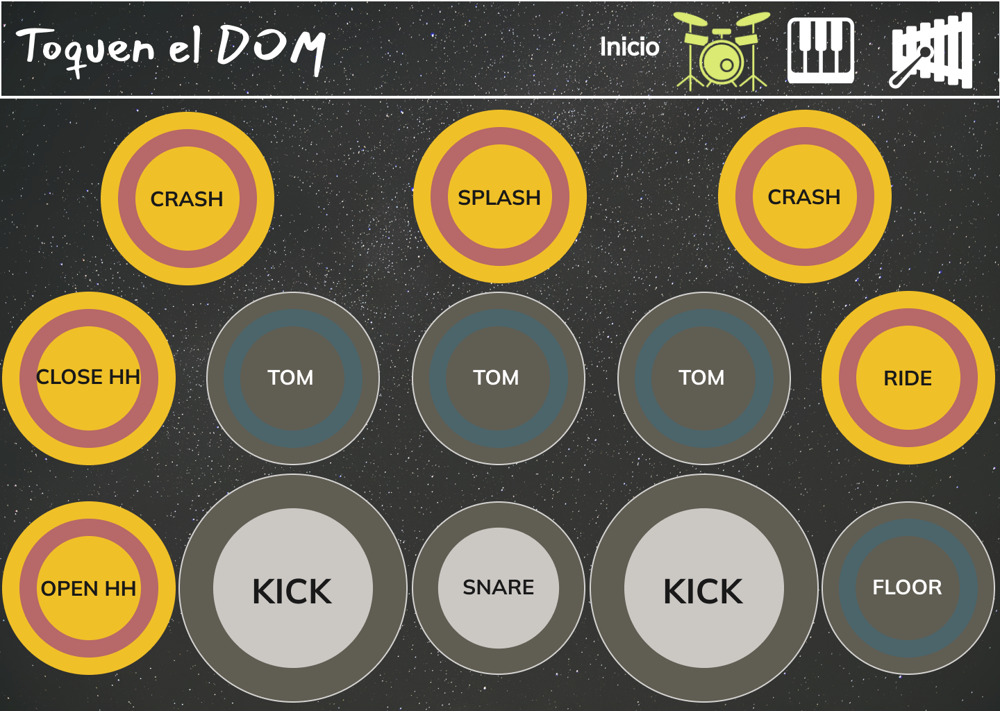

# Proyecto-Escuela-Musical-Toquen
En este repositorio se encuentra en codigo de una página web para una una escuela de música online, con el plus de que los usuarios van a poder practicar con algunos de los instrumentos porque estos van a reproducir sonidos con click o con pulsaciones de teclado. 

- Se realizo ProductBacklog en Trello
- Se realizaron Mockups en figma, en tamaños de escritorio y movil.
- El MVP se hizo en figma, agragando funcionalidad a los botones de menu existentes en cada pagina.
- El pyoyecto se desarrollo en Html, Css y JavaScript.

Por medio de EventListeners se agragaron las interacciones con las teclas de los intrumentos, ya que emitiran sonidos acorde al instrumento cuando se haga click con el mouse o se presionen ciertas teclas en el teclado fisico del pc.

**Resultados esperados**

Er resultado final debera corresponder a los Mockups planteados, los cuales se encuentran en la carpeta [Mockups](./Mockups).

Como un ejemplo, así debe verse la secciòn correspondiente a el instrumento "Batería":

**Movil**



**Escritorio**




## Requisitos Técnicos

* El proyecto DEBE implementar metodología SCRUM.
* El proyecto tendrá un sprint de 6 días hábiles.
* Se DEBE planear el sprint en un product backlog.
* Se DEBE utilizar GitFlow.
* La página DEBE tener un diseño agradable, alusivo a la educación y a la múscia y responsive.
* Los break points son:

```css

 /* Small (sm) */ @media (min-width: 640px) {...}

 /* Medium (md) */ @media (min-width: 768px) {...}
 
 /* Large (lg) */ @media (min-width: 1024px) {...}
 
 /* Extra Large (xl) */ @media (min-width: 1280px) {...} 

 ```
 
* La página debe tener un instrumento a elegir entre piano, batería, y la marimba.
* El diseño del instrumento es de libre elección, se pueden diseñar los componentes aparte o utilizar recursos externos, si se utilizan recursos externos deben ser gratis, no se permite el plagio.
* Los sonidos deben corresponder (En el caso del piano y la marimba las notas deben estar en el orden correcto, los mismo con las partes de la batería).
* El instrumento se DEBE poder tocar con el mouse.
* El instrumento se DEBE poder tocar con el teclado.
* se DEBE poder tocar de manera repetida y cuantas veces quiera el usuario.
* El sonido de una parte del instrumento DEBE poder sonar a la par con las demás partes (Teclas para el piano, barras para la marimba y platillos, bombo, redoblante, etc para la batería).
* Cuando se toque un elemento del instrumento DEBE mostrar algún movimento ( Ya sea Vibración,  movimiento, o el efecto de que se oprime en el caso de las teclas)
* El código DEBE ser ordenado, identado, semántico y con buenas prácticas de desarrollo: clean code.
* La distribución del contenido DEBERÍA hacerse con Flex-box o Grid system.
* No se pueden utilizar frameworks ni librerías, el desarrollo debe ser vanilla.

## Fuentes a Consultar

* https://www.w3schools.com/w3css/w3css_templates.asp
* 
* https://www.codeseek.co/preview/womJzx
* 
* https://www.youtube.com/watch?v=iS1vCsF_pNY
* 
* https://www.codeseek.co/preview/KgWxyq
* 
* https://www.w3.org/Style/Examples/011/firstcss.es.html
* 
* https://www.thebeatles.com/explore?type=story_album
* 
* https://developer.mozilla.org/es/docs/Web/CSS/CSS_Grid_Layout
* 
* https://developer.mozilla.org/es/docs/Web/CSS/CSS_Flexible_Box_Layout/Basic_Concepts_of_Flexbox
* 
* https://css-tricks.com/snippets/css/a-guide-to-flexbox/
* 
* https://www.w3schools.com/js/
* 
* https://developer.mozilla.org/es/docs/Web/JavaScript

## Entregables

- Enlace del Product backlog.
- Mockups del proyecto en formato escritorio y móvil.
- Enlace del respositorio de GitHub con un MVP (Producto mínimo viable).
- Enlace del repositorio en Github con un Readme que explique lo que se ha desarrollado.
- Enlace del deploy en Github pages.

## Autors
Karen Rosales <a href="" target="blank"></a>

Jymmy Murillo Bernal <a href="https://www.linkedin.com/in/murillojymmy/" target="blank"></a>